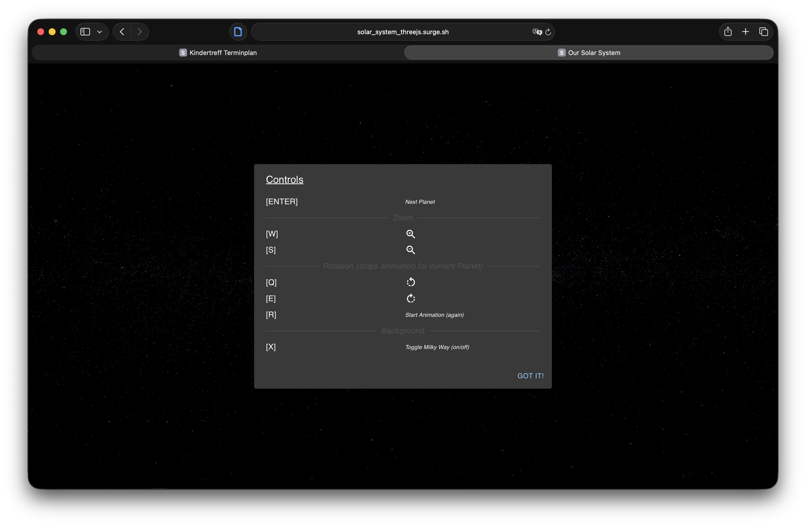
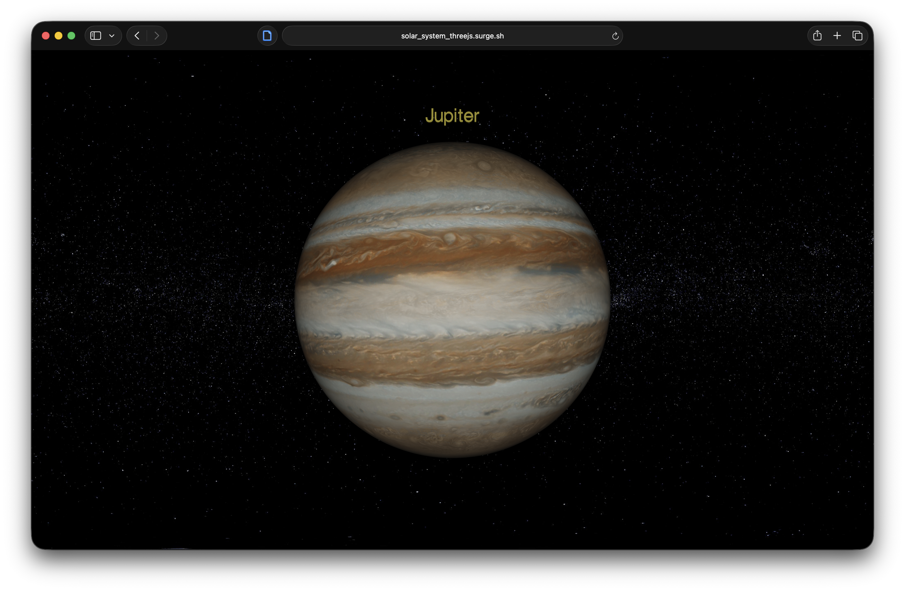

# 🌌 Solar System

An interactive solar system website built with **React** and **Vite**.

The project visualizes the planets of our solar system and provides an interactive way to explore them.

---

## Preview

<p align="center">
  <a href="https://solar_system_threejs.surge.sh">
    
  </a>
  <a href="https://solar_system_threejs.surge.sh">
    
  </a>
</p>

---

## Features

- Interactive solar system visualization
- Individual planet views
- Responsive design
- Smooth and modern UI
- Fast development and build setup using Vite

---

## Built With

- Three.js
- JavaScript
- Vite
- HTML
- CSS

---

## Installation

Clone the repository:

```bash
git clone https://github.com/YOUR_USERNAME/solar_system.git
```
